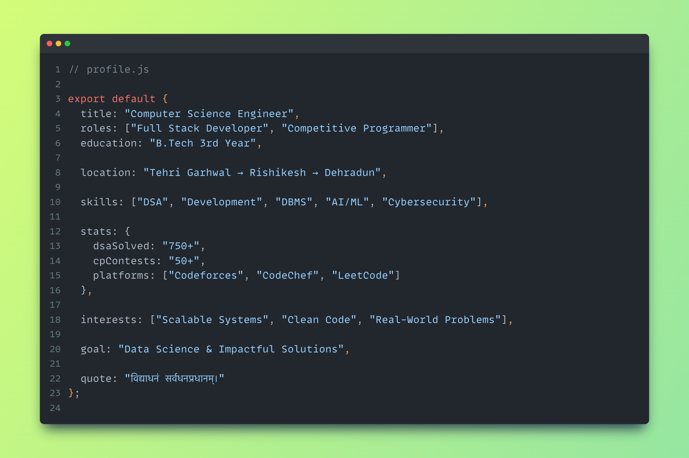
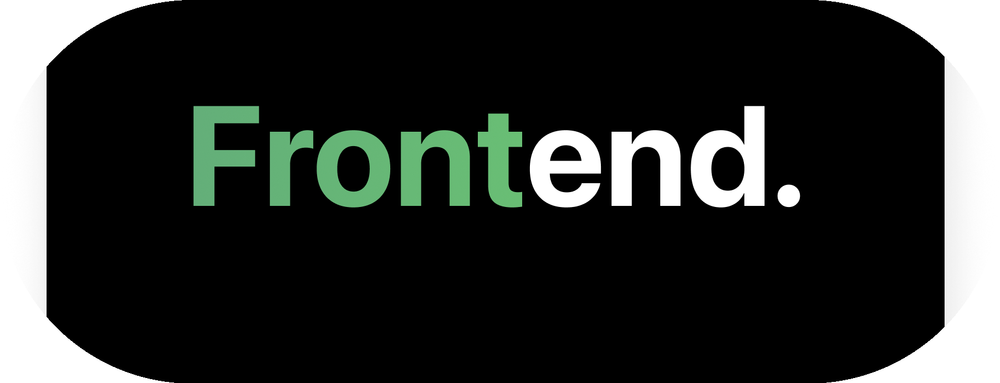
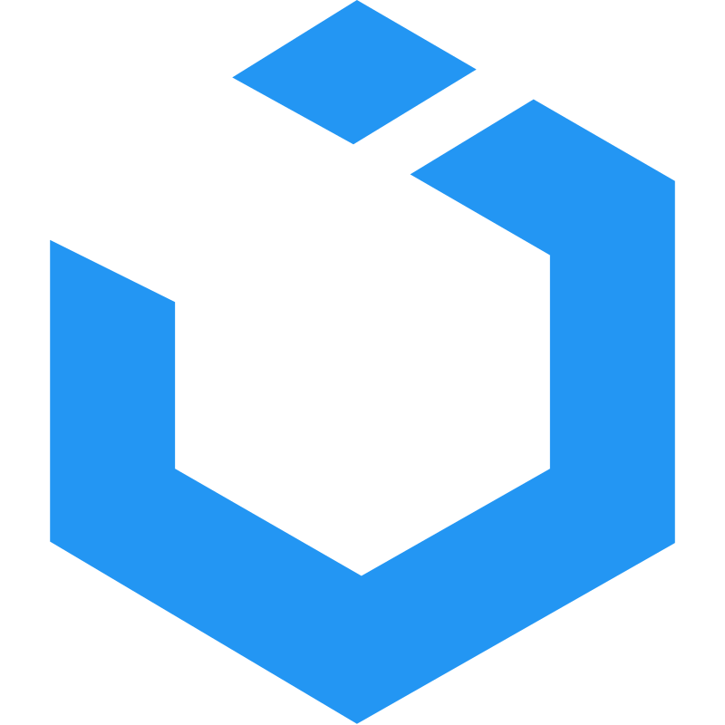
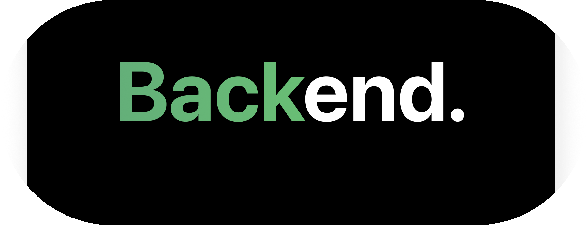
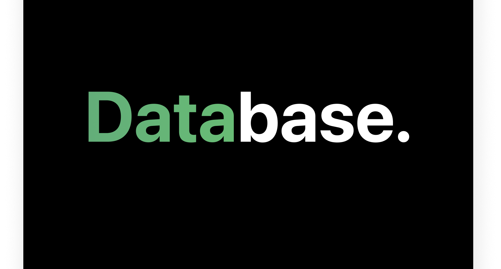
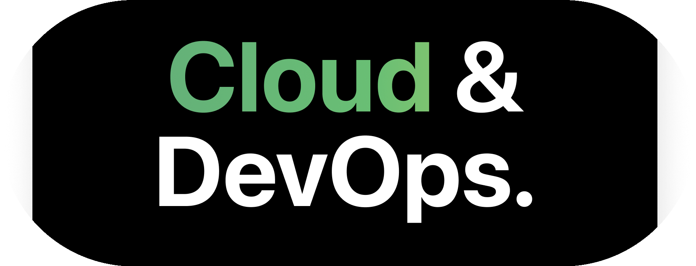
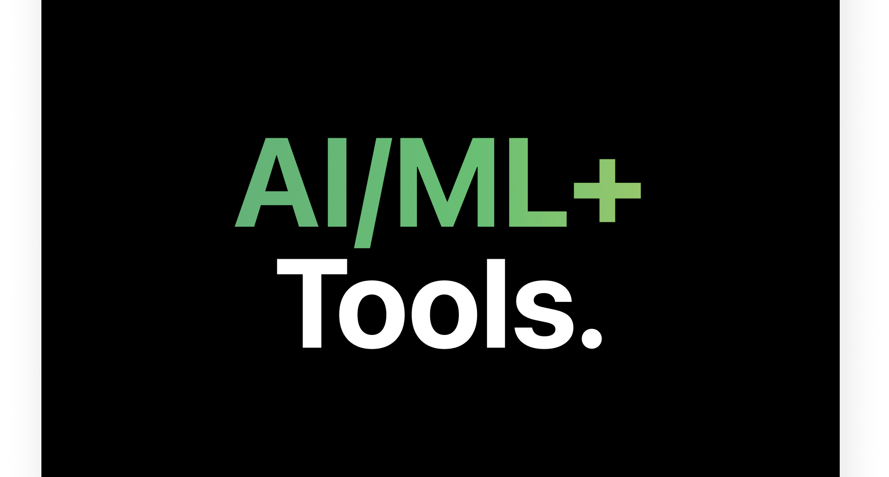
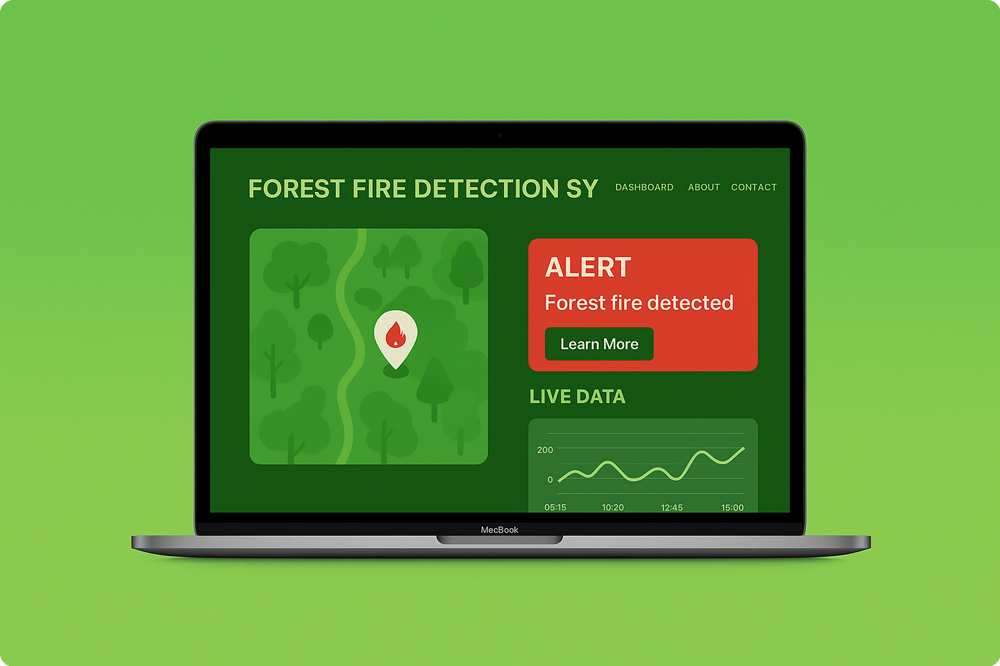
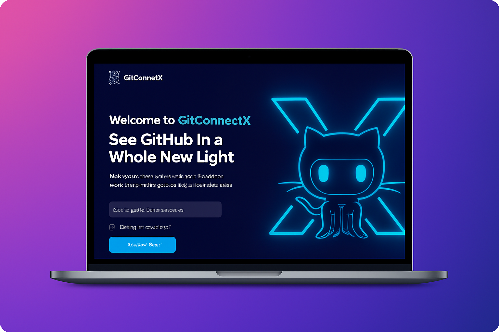

  

## About Me

  

  

<!-- Divider animation -->

## Synapse

  <table width="100%">
    <tr>
      <td width="50%" align="center">
        
      </td>
      <td width="50%" align="center">
        
      </td>
    </tr>
    <tr>
      <td width="50%" align="center">
        
      </td>
      <td width="50%" align="center">
        
      </td>
    </tr>
  </table>

   

  <!-- Row 3: Summary -->
  

 

<h2>Achievements</h2>

  
  
  
  

 

## Tech Stack Arsenals

<table border="0" width="100%" cellpadding="0" cellspacing="0">
  <tr>
    <td width="200" align="center" valign="middle">
      
    </td>
    <td valign="middle">
        
    </td>
  </tr>
  <tr>
    <td width="200" align="center" valign="middle">
      
    </td>
    <td valign="middle">
         
    </td>
  </tr>
  <tr>
    <td width="200" align="center" valign="middle">
      
    </td>
    <td valign="middle">
      
    </td>
  </tr>
  <tr>
    <td width="200" align="center" valign="middle">
      
    </td>
    <td valign="middle">
       
    </td>
  </tr>
  <tr>
    <td width="200" align="center" valign="middle">
      
    </td>
    <td valign="middle">
      
    </td>
  </tr>
  <tr>
    <td width="200" align="center" valign="middle">
      
    </td>
    <td valign="middle">
        
    </td>
  </tr>
</table>

 
 

 

## Featured Projects

### GitConnectX - GitHub Social Network Analyzer

  
  
  
  

 

**Advanced GitHub Social Network Analysis Platform**

<table>
<tr>
<td width="50%">

**Core Features**
- Data Processing: 500+ user social graphs
- Algorithm Integration: Dijkstra's, BFS, Louvain, Girvan-Newman
- Dynamic Visualization: D3.js community detection
- Real-time graph processing
- Responsive React interface

</td>
<td width="50%">

**Technical Highlights**
- Centrality ranking algorithms
- Interactive graph visualizations
- Optimized data structures
- REST API integration
- Performance-optimized rendering

</td>
</tr>
</table>

**[View Source Code](https://github.com/savetree-1/GitConnectX)**

### Forest Fire Detection System

<table>
<tr>
<td width="55%">
  

  
    
  
  
  
  
  

</td>
<td width="45%">
  <h4>AI-Powered Real-Time Fire Detection System</h4>
  <strong>Model Performance</strong>
  <ul>
    <li>Accuracy: 94% in fire/non-fire classification</li>
    <li>Custom CNN architecture with 1,000+ labeled images</li>
    <li>Inference latency: <300ms</li>
  </ul>
  <strong>Capabilities</strong>
  <ul>
    <li>Real-time webcam & video file processing</li>
    <li>TensorFlow Lite optimization & Multi-source input</li>
  </ul>
   
  <a href="https://github.com/savetree-1/Projects/tree/main/Mini%20Projects/forest_fire_detection_uttarakhand"><strong>View Source Code</strong></a>
</td>
</tr>
</table>

### MetaShield - Metadata Stripping Tool

<table>
<tr>
<td width="55%">
  

  
    
  
  
  
  
  

</td>
<td width="45%">
  <h4>Advanced File Metadata Sanitization Tool</h4>
  <strong>Format Support</strong>
  <ul>
    <li>Images (JPG, PNG), Videos (MP4, MOV), Docs (PDF, DOCX)</li>
    <li>Batch processing: 100+ files</li>
  </ul>
  <strong>Features</strong>
  <ul>
    <li>Complete metadata removal & Privacy protection</li>
    <li>Drag-and-drop interface with Real-time progress</li>
  </ul>
   
  <a href="https://github.com/savetree-1/MetaShield_"><strong>View Source Code</strong></a>
</td>
</tr>
</table>

### Image Steganography - Secure Cryptography

<table>
<tr>
<td width="55%" align="center">
   
  
    
  
  
</td>
<td width="45%">
  <h4>Advanced Steganographic Message Hiding System</h4>
  <strong>Features</strong>
  <ul>
    <li>Password-protected encryption & MSB-based embedding</li>
    <li>Zero visual distortion & Data integrity validation</li>
    <li>Tkinter GUI, JPEG/PNG support, Reliable recovery</li>
  </ul>
   
  <a href="https://github.com/savetree-1/Projects/tree/main/Mini%20Projects/image_steganography"><strong>View Source Code</strong></a>
</td>
</tr>
</table>

## Competitive Programming Statistics

<table>
<tr>
<th>Platform</th>
<th>Rating</th>
<th>Global Rank</th>
<th>Problems Solved</th>
<th>Achievement</th>
</tr>
<tr>
<td align="center"></td>
<td align="center"><strong>2000+</strong></td>
<td align="center"><strong>5713</strong> (Top 7%)</td>
<td align="center"><strong>300+</strong></td>
<td align="center">Expert Level</td>
</tr>
<tr>
<td align="center"></td>
<td align="center"><strong>1800+</strong> (4★)</td>
<td align="center"><strong>4555</strong></td>
<td align="center"><strong>250+</strong></td>
<td align="center">4 Star Coder</td>
</tr>
<tr>
<td align="center"></td>
<td align="center"><strong>Expert</strong></td>
<td align="center">-</td>
<td align="center"><strong>200+</strong></td>
<td align="center">Expert Rating</td>
</tr>
<tr>
<td align="center"><strong>TOTAL</strong></td>
<td align="center">-</td>
<td align="center">-</td>
<td align="center"><strong>750+</strong></td>
<td align="center">Multi-Platform Expert</td>
</tr>
</table>

## Professional Experience & Certifications

### SWAYAM NPTEL Certification Program
**Duration:** Dec 2023 - Apr 2025 | **Status:** Discipline Star Awardee

<table>
<tr>
<td width="50%">

**Key Achievements**
- Top 5% in "Programming in C" (IIT Kanpur)
- Elite + Silver Medal in Google Cloud Platform
- NPTEL Discipline Star across 5+ courses
- 50+ Certified Learning Hours
- Multi-domain expertise

</td>
<td width="50%">

**Course Highlights**
- Advanced Cloud Computing & Systems Design
- Data Structures & Algorithms Optimization
- Machine Learning & Data Science
- Software Engineering Best Practices
- Distributed Systems Architecture

</td>
</tr>
</table>

### CN Dominator Challenge
**Duration:** Dec 2023 (30-Day Program) | **Platform:** Coding Ninjas

<table>
<tr>
<td width="25%" align="center">
<h3>27/1000+</h3>
<strong>Top 3% Rank</strong>
</td>
<td width="25%" align="center">
<h3>90%</h3>
<strong>Completion Rate</strong>
</td>
<td width="25%" align="center">
<h3>30</h3>
<strong>Challenges Solved</strong>
</td>
<td width="25%" align="center">
<h3>100%</h3>
<strong>Consistency</strong>
</td>
</tr>
</table>

## Awards & Recognition

### Academic Excellence
<table>
<tr>
<th>Award</th>
<th>Institution</th>
<th>Year</th>
<th>Achievement</th>
</tr>
<tr>
<td><strong>NPTEL Discipline Star</strong></td>
<td>IIT Consortium</td>
<td>2025</td>
<td>Multi-course Excellence</td>
</tr>
<tr>
<td><strong>Elite + Silver Medal</strong></td>
<td>IIT Kanpur</td>
<td>2024</td>
<td>Top 5% Programming in C</td>
</tr>
<tr>
<td><strong>Elite + Silver Medal</strong></td>
<td>IIT Kharagpur</td>
<td>2024</td>
<td>Google Cloud Platform</td>
</tr>
<tr>
<td><strong>PMO Appreciation</strong></td>
<td>Prime Minister's Office</td>
<td>2023</td>
<td>PMSS Scholarship</td>
</tr>
</table>

 

### Competitive Programming
<table>
<tr>
<th>Competition</th>
<th>Rank</th>
<th>Participants</th>
<th>Achievement</th>
</tr>
<tr>
<td><strong>CN Dominator Challenge</strong></td>
<td>27</td>
<td>1000+</td>
<td>Top 3%</td>
</tr>
<tr>
<td><strong>LeetCode Global</strong></td>
<td>5713</td>
<td>100,000+</td>
<td>Top 7%</td>
</tr>
<tr>
<td><strong>CodeChef Rating</strong></td>
<td>4555</td>
<td>50,000+</td>
<td>4 Star Coder</td>
</tr>
</table>

 

### Mathematical Olympiads
<table>
<tr>
<th>Olympiad</th>
<th>Medal</th>
<th>Level</th>
<th>Recognition</th>
</tr>
<tr>
<td><strong>IMA (International)</strong></td>
<td>Gold</td>
<td>International</td>
<td>Excellence Award</td>
</tr>
<tr>
<td><strong>NSO (National)</strong></td>
<td>Silver</td>
<td>National</td>
<td>Top Performer</td>
</tr>
<tr>
<td><strong>ISKO (International)</strong></td>
<td>Silver</td>
<td>International</td>
<td>Merit Award</td>
</tr>
<tr>
<td><strong>Zonal Mathematics</strong></td>
<td>Top-10</td>
<td>Regional</td>
<td>Rank Holder</td>
</tr>
</table>

## Connect With Me

  

## Contact Information

  
<table>
<tr>
<td align="center" width="25%">
 
<strong>ankush.rawat.work@gmail.com</strong>
</td>
<td align="center" width="25%">
 
<strong>+91 74540619XX</strong>
</td>
<td align="center" width="25%">
 
<strong>Dehradun, Uttarakhand</strong>
</td>
<td align="center" width="25%">
 
<strong>Graphic Era Hill University</strong>
</td>
</tr>
</table>

  
### **"Transforming ideas into innovative solutions through code, one algorithm at a time."**

 

  

