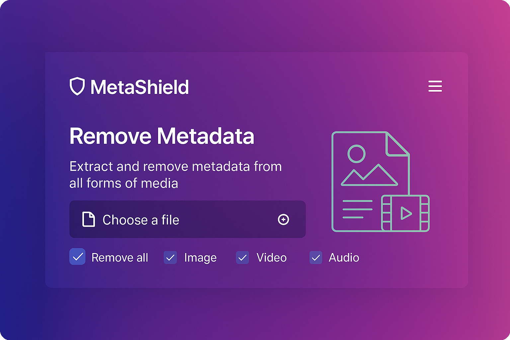
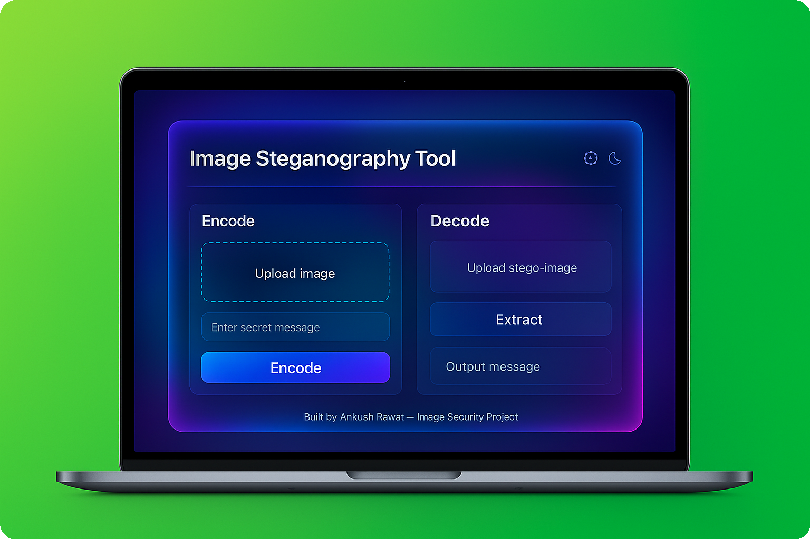
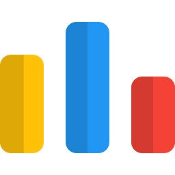

  

## About Me

  

<!-- Divider animation -->

## Synapse

  <table width="100%">
    <tr>
      <td width="50%" align="center">
        
      </td>
      <td width="50%" align="center">
        
      </td>
    </tr>
    <tr>
      <td width="50%" align="center">
        
      </td>
      <td width="50%" align="center">
        
      </td>
    </tr>
  </table>

   

  <!-- Row 3: Summary -->
  

 

<h2>Achievements</h2>

  
  
  
  

 

## Tech Stack Arsenals

<table border="0" width="100%" cellpadding="0" cellspacing="0">
  <tr>
    <td width="200" align="center" valign="middle">
      
    </td>
    <td valign="middle">
        
    </td>
  </tr>
  <tr>
    <td width="200" align="center" valign="middle">
      
    </td>
    <td valign="middle">
         
    </td>
  </tr>
  <tr>
    <td width="200" align="center" valign="middle">
      
    </td>
    <td valign="middle">
      
    </td>
  </tr>
  <tr>
    <td width="200" align="center" valign="middle">
      
    </td>
    <td valign="middle">
       
    </td>
  </tr>
  <tr>
    <td width="200" align="center" valign="middle">
      
    </td>
    <td valign="middle">
      
    </td>
  </tr>
  <tr>
    <td width="200" align="center" valign="middle">
      
    </td>
    <td valign="middle">
        
    </td>
  </tr>
</table>

 
 

 

## Featured Projects

### GitConnectX - GitHub Social Network Analyzer

<table>
<tr>
<td width="55%">
  

  
  

</td>
<td width="45%">
  <h4>Advanced GitHub Social Network Analysis Platform</h4>
  

  
  
  
  
  

  <strong>Core Features</strong>
  <ul>
    <li>Data Processing: 500+ user social graphs</li>
    <li>Algorithm Integration: Dijkstra's, BFS, Louvain, Girvan-Newman</li>
    <li>Dynamic Visualization: D3.js community detection</li>
  </ul>
  <strong>Technical Highlights</strong>
  <ul>
    <li>Centrality ranking algorithms & Interactive graph visualizations</li>
    <li>Optimized data structures & REST API integration</li>
    <li>Performance-optimized rendering</li>
  </ul>
   
  <a href="https://github.com/savetree-1/GitConnectX"><strong>View Source Code</strong></a>
</td>
</tr>
</table>

### Forest Fire Detection System

<table>
<tr>
<td width="55%">
  

  
  

</td>
<td width="45%">
  <h4>AI-Powered Real-Time Fire Detection System</h4>
  

  
  
  
  
  

  <strong>Model Performance</strong>
  <ul>
    <li>Accuracy: 94% in fire/non-fire classification</li>
    <li>Custom CNN architecture with 1,000+ labeled images</li>
    <li>Inference latency: <300ms</li>
  </ul>
  <strong>Capabilities</strong>
  <ul>
    <li>Real-time webcam & video file processing</li>
    <li>TensorFlow Lite optimization & Multi-source input</li>
  </ul>
   
  <a href="https://github.com/savetree-1/Projects/tree/main/Mini%20Projects/forest_fire_detection_uttarakhand"><strong>View Source Code</strong></a>
</td>
</tr>
</table>

### MetaShield - Metadata Stripping Tool

<table>
<tr>
<td width="55%">
  

  
  

</td>
<td width="45%">
  <h4>Advanced File Metadata Sanitization Tool</h4>
  

  
  
  
  
  

  <strong>Format Support</strong>
  <ul>
    <li>Images (JPG, PNG), Videos (MP4, MOV), Docs (PDF, DOCX)</li>
    <li>Batch processing: 100+ files</li>
  </ul>
  <strong>Features</strong>
  <ul>
    <li>Complete metadata removal & Privacy protection</li>
    <li>Drag-and-drop interface with Real-time progress</li>
  </ul>
   
  <a href="https://github.com/savetree-1/MetaShield_"><strong>View Source Code</strong></a>
</td>
</tr>
</table>

### Image Steganography - Secure Cryptography

<table>
<tr>
<td width="55%">
  

  
  

</td>
<td width="45%">
  <h4>Advanced Steganographic Message Hiding System</h4>
  

  
  
  
  
  

  <strong>Features</strong>
  <ul>
    <li>Password-protected encryption & MSB-based embedding</li>
    <li>Zero visual distortion & Data integrity validation</li>
    <li>Tkinter GUI, JPEG/PNG support, Reliable recovery</li>
  </ul>
   
  <a href="https://github.com/savetree-1/Projects/tree/main/Mini%20Projects/image_steganography"><strong>View Source Code</strong></a>
</td>
</tr>
</table>

## Competitive Programming Statistics

<table>
<tr>
<td width="33%" align="center">
  
    
  <strong>LeetCode</strong> 
  Guardian 2100+
</td>
<td width="33%" align="center">
  
    
  <strong>Codeforces</strong> 
  Expert 1600+
</td>
<td width="33%" align="center">
  
    
  <strong>CodeChef</strong> 
  4 Star 1800+
</td>
</tr>
</table>

## Certifications

<table>
<tr>
<td width="25%" align="center">
  
</td>
<td width="75%">
  <strong>AWS Cloud Practitioner Essentials</strong>
  <ul>
    <li>Fundamental understanding of AWS Cloud concepts and security.</li>
    <li>Core services: Compute, Storage, Database, and Networking.</li>
    <li>Cloud architectural principles and pricing models.</li>
  </ul>
</td>
</tr>
<tr>
<td width="25%" align="center">
  
</td>
<td width="75%">
  <strong>Introduction to Cybersecurity</strong> 
  <em>Cisco Networking Academy</em>
  <ul>
    <li>Foundational knowledge of cyber threats and defense strategies.</li>
    <li>Network security basics and data protection principles.</li>
    <li>Understanding enterprise security infrastructure.</li>
  </ul>
</td>
</tr>
<tr>
<td width="25%" align="center">
  
</td>
<td width="75%">
  <strong>Google Cloud Computing Foundations</strong>
  <ul>
    <li>Core infrastructure and big data capabilities of GCP.</li>
    <li>Introduction to Machine Learning and AI on Google Cloud.</li>
    <li>Building and deploying scalable cloud applications.</li>
  </ul>
</td>
</tr>
<tr>
<td width="25%" align="center">
  
</td>
<td width="75%">
  <strong>The Joy of Computing using Python</strong> 
  <em>NPTEL Online Certification</em>
  <ul>
    <li>Comprehensive Python programming and algorithmic thinking.</li>
    <li>Hands-on problem solving and code optimization.</li>
    <li>Data structures and functional programming concepts.</li>
  </ul>
</td>
</tr>
<tr>
<td width="25%" align="center">
  
</td>
<td width="75%">
  <strong>Google Cloud Computing Foundations (NPTEL)</strong> 
  <em>NPTEL Online Certification</em>
  <ul>
    <li>In-depth cloud computing curriculum offered via NPTEL.</li>
    <li>Focus on cloud architecture, virtualization, and containerization.</li>
    <li>Practical implementation of cloud resources and management.</li>
  </ul>
</td>
</tr>
</table>

## Honors & Achievements

My journey is marked by consistent academic excellence and national-level recognition. In my 3rd year, I was selected for the exclusive **iOS Student Developer Program**—a prestigious initiative powered by **[Infosys](https://www.infosys.com)** and **[Apple](https://www.apple.com)**—joining a select batch of 100 students across all university campuses. In 2025, I was selected as a Mentee for the **[Amazon ML Summer School](https://www.amazon.science/academic-engagements/amazon-ml-summer-school)** and recognized as a **Microsoft SEFA '25** scholar. I secured a **99.13 percentile** in **[Naukri.com's Young Turks](https://www.naukri.com)** challenge (achieving All India Rank #3559 in Round 2), placing me among the top talent nationwide.

Academically, I received a distinctive **Congratulatory Letter from the [Prime Minister's Office](https://www.pmindia.gov.in)** for outstanding merit, awarding me the **PMSS Scholarship** (National Defence Fund). My dedication to continuous learning was recognized by **[NPTEL](https://nptel.ac.in)** as a **Discipline Star**—an honor given for completing 50+ weeks of coursework with excellence. This includes earning an **Elite + Gold Medal** in *The Joy of Computing using Python* (IIT Madras) and **Elite + Silver Medals** in *Google Cloud Computing Foundations* (IIT Kharagpur) and *Programming in C* (IIT Kanpur, Top 5%).

In the competitive arena, I ranked in the **Top 3%** (Rank **#27**) of the **[Coding Ninjas](https://www.codingninjas.com)** Dominator Challenge, achieved a **Top 7% Global Rank** on **[LeetCode](https://leetcode.com)** (solving **600+ problems**), and earned a **4-Star Rating** on **[CodeChef](https://www.codechef.com/users/savetree-1)**. My foundation in problem-solving is rooted in early successes, including winning a **Gold Medal** in the **International Mathematic Olympiad (IMA)**, **Silver Medals** in both the **National Science Olympiad (NSO)** and **International Science & Knowledge Olympiad (ISKO)**, and a **Top-10 Rank** in the **Zonal Mathematics Olympiad**.

## Connect & Contact

<table>
<tr>
<td align="center" width="25%">
   
  <strong>ankush.rawat.work@gmail.com</strong>
</td>
<td align="center" width="25%">
   
  <strong>ankus4rawat</strong>
</td>
<td align="center" width="25%">
   
  <strong>savetree-1</strong>
</td>
<td align="center" width="25%">
   
  <strong>Dehradun, Uttarakhand</strong>
</td>
</tr>
</table>

  
### **"Transforming ideas into innovative solutions through code, one algorithm at a time."**

 

  

